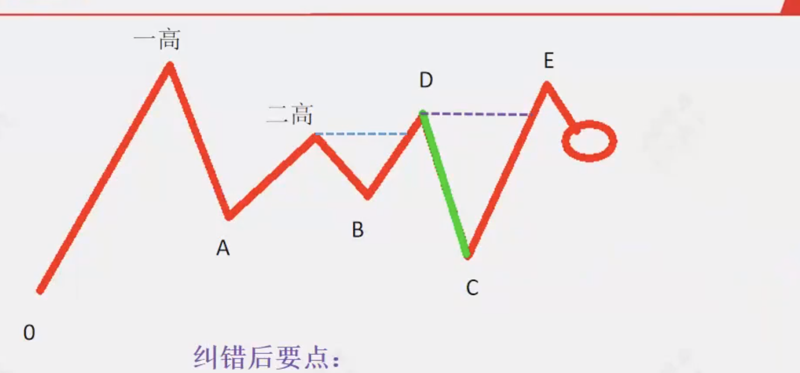

# 买入时机
* 符合强势模型
* 扭转二高或纠错转前高之后
* 回踩操盘线

低吸买入核心：遵循上涨趋势，确认主升。

回踩操盘价1%的位置

# 卖出时机
* 趋势--多空趋势线（趋势强度/变绿）
* 衰竭--操盘决策（资金获利回吐/衰竭）

# 主身低吸的来源 #
上涨的来源来自下跌
所有上涨的趋势都来自于不创新低
排除下跌就是上涨趋势
排除调整就是主升趋势
确定资金强势共识
找到确认主升后的低吸点

排除下跌趋势，三个低点上移

一涨：避免下跌趋势中的诱多
底部强扭转，拐点出现后的多头上涨趋势
* 位置 超低先锋
* 变盘 操盘决策由绿变红，或者黄色占一半
* 扭转 多空趋势线在操盘线上方
* 力量 上涨过程中主力活跃三天以上

二回(两次回落，两次调整)：远离盘整时的震荡，确认趋势 
* 两次调整不创新低（跌破0点）
 用资金来确认调整的开始和结束
 两次资金流出，股价不创新低，上涨趋势确认
 
确认进入主升，扭转二高位置
收盘价不低于二高收盘价*0.99 不大于一高收盘价*1.01

低吸: 买在上涨趋势的初期

## 为什么高点取收盘价？
收盘价比瞬间的最高价更稳定
为什么要取最低点？
最低点代表空头的最强能量

# 模型瑕疵
1. 扭转弱
扭转强势特点:
* 主力活动超过三天
* 最后一次调整低点附近出现5%以上大阳线或者向上跳空缺口
2. 防衰竭
* 收盘价跌破前高
* 资金流出1天
防衰竭的目的是防止买在顶部
3. 回踩操盘线作为买点时，不能出现大阴线（5%以上 或者跳空），空投力量太强，容易跌破
4. 超一高达15%以上，可能一步到位，防止一轮上涨结束

## 为什么瑕疵股票不稳定？
 * 主升趋势 
 * 风险因素
 市场的风险偏好强弱影响瑕疵的走势
 上证60分钟/日线绿色，容易失败
 上证60分钟/日线红色，胜率提高
 总体胜率不如标准走势
 
## 出现瑕疵处理方法？
* 观望，选择标准的
* 小仓位试错，做好纠错准备

# 赚钱核心三要素
 * 发现机会：客观标准来鉴别
 * 赚到利润：避免主观情绪影响，客观面对涨跌波动
 * 及时纠错: 小赚大亏是弊端，永远避免大亏
 

交易的本质就是管理风险

## 管理风险
* 仓位管理
* 非常低的纠错成本

# 仓位管理
大盘决定仓位，个股决定胜负

指数不是胜负的关键，盈亏在个股，我们根据指数调整仓位，不冒险

纠错的意义在于防止大跌，永不会大亏

## 纠错后跟踪

等再次强势扭转跌势，收复跌幅，回踩入场
E不是收复二高，是收复D起跌点
C不能跌破0点

